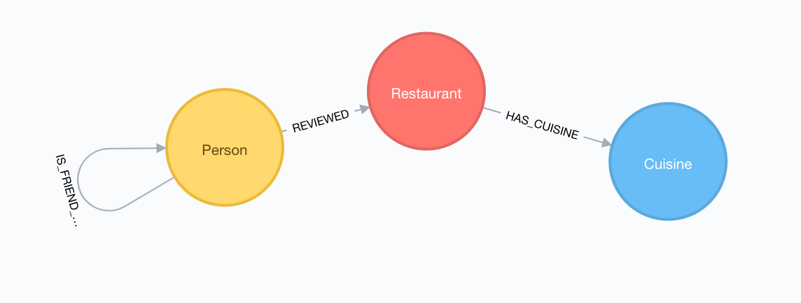
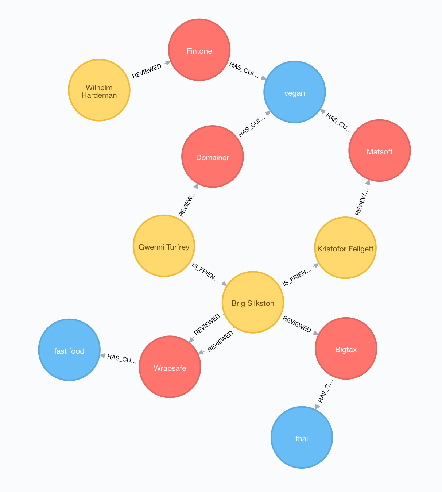
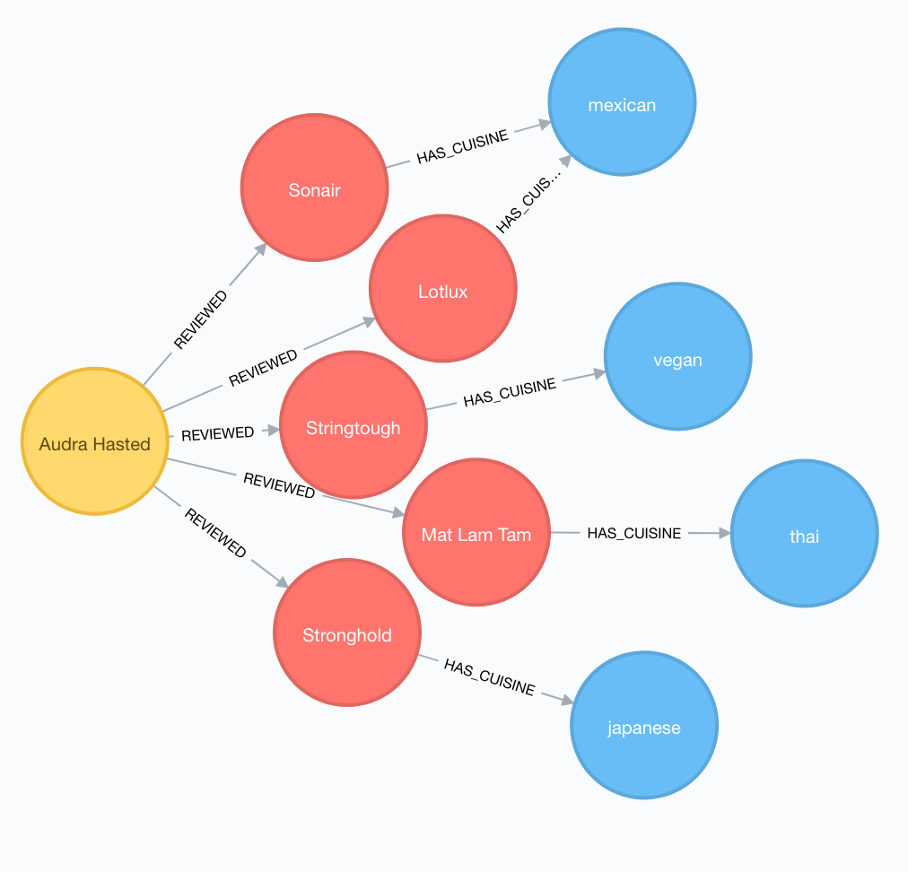
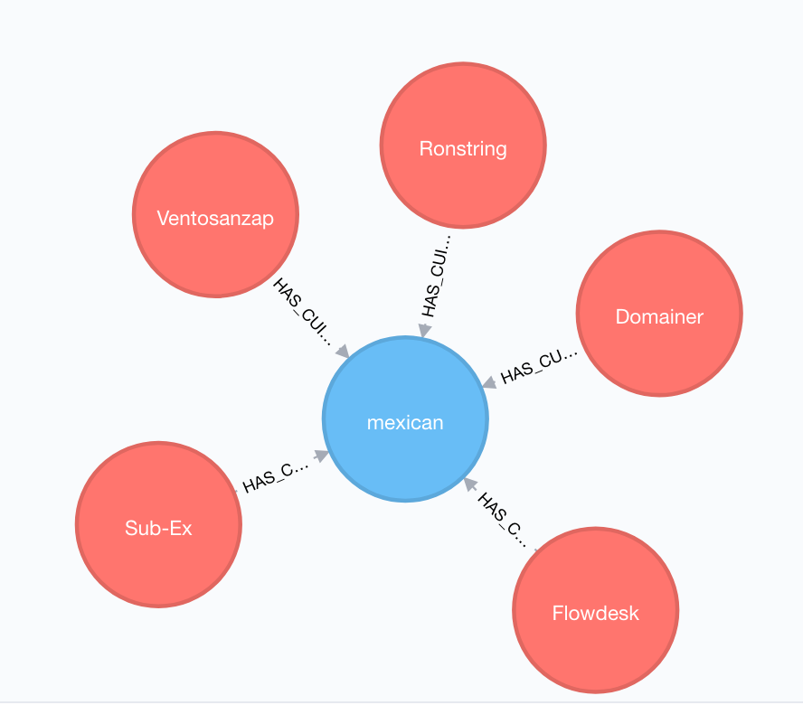

## Challenges
Recommendation engines pull information from a broad view of an environment. This information could address historical data, sentiment analysis, geographical data, almost anything we could imagine. 

Effective marketing tools should be able to capture the attention of users with precise in-app suggestions based on disparate data sources, in a short time window before their users lost attention. 

When we deal with a huge amount of data, coming from different data sources, we need to implement a solution that is at the same time fast and precise. We want to provide our clients accurate recommendations, but at the same time, we need to do this as quick as possible, while our client is still interested.

Graphs offer us a tool to manage recommendations, and, with the improvements in graph databases and graph engines, we can implement solutions that attend our time and accuracy requirements.

Here, we propose a graph-based approach to solve the challenges in recommendations systems for restaurants. We used Neo4j 3.3.1 as our graph solution do implement our recommendation system.

## Graph Data for Restaurants Recommendation
Our data contains information about Customers, Restaurants and Cuisines. The way data link can be seen in Figure 1.



The node Person contains the data that describe Restaurant customers. This node has the following attributes: id, name and gender. 

Restaurants only have one attribute that is its name, the same is verified in Cuisine node, that only has information of cuisine type.

It does not make sense to have data that does not connect to other data. Our proposed graph links data in the way that we can represent how a Person is linked to other Person, via its relationship IS_FRIEND_WITH. A Person also could review a Restaurant, and this link between them is addressed by the relationship REVIEWS, which also has a rating and a date. Finally, any Restaurant is linked to a Cuisine.

Our model allows identifying how people interact with restaurants and, of course,  cuisines.  Also,  we can identify restaurants in each cuisine type and its ratings based on customers reviews.

## Building a Recommendation Engine
When working with recommendation systems, our go is to provide the most accurate recommendation to the user. Our recommendation engine is capable of recommending Restaurants based on friendships and Cuisines. 

Let's start showing how can we recommend a Restaurant to a Person based on its friends' preferences.  Considering that we want to recommend a restaurant to the user "Audra Hasted" (id: 15), we have the following Cypher query:

```
MATCH (p:Person{id:15}) WITH p
MATCH (p)-[:IS_FRIEND_WITH]-(f:Person)-[rev:REVIEWED]-(r:Restaurant)--(c:Cuisine)
WHERE rev.rating > 2 AND  NOT (p)-[:REVIWED]-(r)
WITH r, collect(f) AS fs, avg(rev.rating) AS av,c
RETURN r.name AS Restaurant, c.cuisine AS Cuisine ,size(fs) AS Friends_Reviewed, av as Average_Rating ORDER BY size(fs) DESC,av DESC LIMIT 5
```

Beginning on the node Person{id:15}, that is our user Audra Hasted, we start traversing the graph to find the best recommendations. This recommendation is made based on different steps:

* Identify Audra's friends;
* From Audra's friends, get those restaurants that they reviewed with a rating > 5;
* Consider only restaurants that Audra never reviewed;
* Recommend the best 5 matches.

Our ranking criteria is based on:
    
* Restaurants that was reviewed by most Audra's friends and;
* Average review rating.

Given the previous scenario we described, we can recommend Audra with the following restaurants:

|Restaurant	| Cuisine	| Friends_Reviewed	| Average_Rating|
|---|---|---|---|
|Flowdesk|	japanese|	3	|3.6|
|Sonsing|fast food|	3	|3.6|
|Mat Lam Tam|thai|	2	|4.5|
|Redhold|mexican|	2	|4|
|Sub-Ex|mexican|	2	|4|

The output graph for this recommendation can be seen in Figure 2.




The previous approach of recommending restaurants based on user's friends sometimes could not be the best choice. If we want to advise a list of restaurants that match user's cuisine preferences, we need to follow a different solution.

The Cypher query below shows how we can, based on user's cuisine preferences, recommend the most relevant restaurants.

```
MATCH (p:Person{id:15}) WITH p
MATCH (p)-[rev:REVIEWED]->(r:Restaurant)-[:HAS_CUISINE]->(c:Cuisine)
WHERE rev.rating > 2
WITH c,avg(rev.rating) as rating, collect(r) as rs, p
WITH p, c order by size(rs) DESC, rating DESC LIMIT 1,
MATCH (c)<-[:HAS_CUISINE]-(r:Restaurant)<-[rev:REVIEWED]-(others:Person)
WHERE NOT p = others
WITH r, sum(rev.rating) as rating, c
RETURN r.name ORDER BY rating DESC LIMIT 5
```

As in the previous example, we will use Audra as our user. At this time, instead of using her friends as the parameter for the recommendation, we will analyse her cuisine preferences.  For that, we have the following steps:

* Identify Audra's reviewed restaurants with rating > 2;
* Get the cuisine type for each of this restaurants;
* Identify the cuisine fo her preference. We identify it based on number of reviewed restaurants with the same cuisine and average review rating;
* After identifying her prefered cuisine, we match those restaurants in the same cuisine that were considered by other users and never reviewed by Audra;
* Our ranking is composed of the top 5 restaurants, based on their total rating.

After performing the previous steps, we can recommend the following restaurants:

|Restaurant	|
|---|
|Redhold|
|Ventosanzap|
|Sub-Ex|
|Transcof|
|Domainer|

The output graphs for Audra's favourite cuisines and top 5  recommendations can be seen in Figures 3 and 4.




## Final Thoughts
Here we showed how simple is to create a Graph-Based Recommendation System, but there are much more possibilities on using graphs for recommendations using Geo-Based data, Social Media content, Marketing Campaign outputs, etc. 

Top names on the market are already using graphs for their recommendation platforms and improving their service.  Recommendations, of course, could be used in different contexts, for example, Cloud Platforms could recommend the best configurations or packages for their users based on users' applications. Another example can be used by Credit Card companies when offering new plans or services to their clients.

For our use case, the use of a graph-based system allowed to implement a system that at the same time is accurate and has great speed performance, even when working with huge amount of data. W started working with 20 users, 100 restaurants and 200 reviews and, after increasing the data to 1000 users, 5000 restaurants and 20000 reviews the impact regarding speed was less than 1%. This is an important feature when working in production environments that must attend millions of users and billions of data nodes.